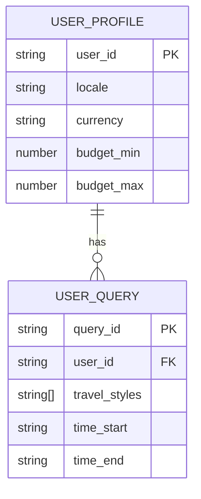
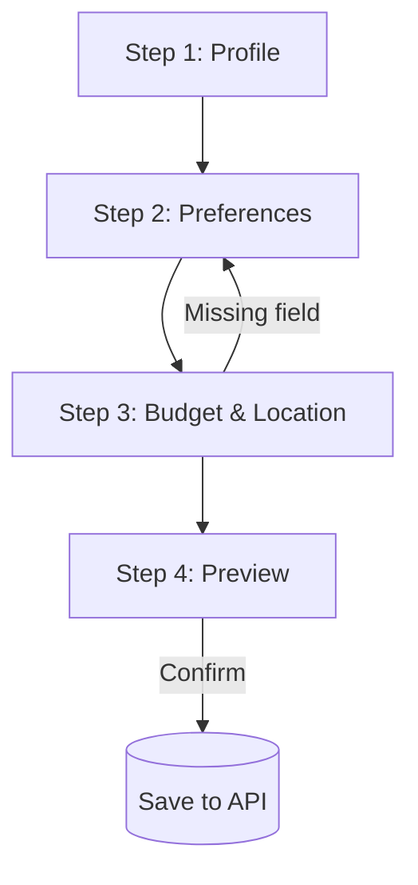

# 🧭 Smart Travel Project

*Operational roadmap, data standards, and UX documentation for an AI-powered travel personalization system.*

> This repository documents **14 structured tasks**, each executable within **1–2 days**, focusing on feature discovery, data modeling, validation, UI/UX flow, and integration testing. It includes objectives, deliverables, acceptance criteria, and sample snippets (JSON/pseudo/diagrams).

---

## 🌍 Overview

The Smart Travel system aims to personalize travel recommendations through structured data and accessible UI. Core objectives:

* Capture **user profiles** and **travel queries** with standardized schemas.
* Build **taxonomies** and **normalization rules** for consistent data.
* Define **clear API contracts** for frontend ↔ backend integration.
* Prototype a **multi-step form** with real-time JSON preview.

---

## 🗓️ Suggested Sprint Plan

| Sprint   | Duration | Focus                                              |
| -------- | -------- | -------------------------------------------------- |
| Sprint 0 | 2–3 days | Data fields (Task 1–2–4), ERD sketch (Task 3)      |
| Sprint 1 | 3–4 days | Data models, validation, API contract (Task 3–5–8) |
| Sprint 2 | 3–4 days | UI wireframes & UX errors (Task 6–7–9)             |
| Sprint 3 | 3–4 days | Prototype + integration tests (Task 10–12)         |
| Wrap-up  | 1–2 days | Security & documentation (Task 13–14)              |

---

## 🗂️ Repository Structure

```
/docs
  /data_dictionary/fields_survey.md
  /taxonomy/taxonomy.json
  /schema/user_profile.schema.json
  /schema/user_query.schema.json
  /rules/normalization_rules.md
  /rules/validation.md
  /ux/ux_errors.md
  /api/api_contract.md
  /design/wireframes/*.png
  /tests/validation_tests.json
  /tests/integration_report.md
/fixtures
  user_profiles.json
  user_queries.json
/README.md
/CONTRIBUTING.md
```

---

## 📏 Conventions

* **Naming:** `snake_case`, English, lowercase
* **Language codes:** [BCP-47](https://www.rfc-editor.org/rfc/bcp/bcp47.txt) (e.g. `en-US`, `pt-BR`, `vi-VN`)
* **Country codes:** ISO-3166
* **Currency codes:** ISO-4217
* **Timezone:** IANA TZ database
* **GPS format:** WGS84, 6 decimal precision
* **Versioning:** semver (`MAJOR.MINOR.PATCH`)

---

## 🚀 Getting Started

1. Review `/docs/data_dictionary/fields_survey.md` for all captured fields.
2. Open `/docs/taxonomy/taxonomy.json` to check standardized enums.
3. Inspect JSON schemas under `/docs/schema/`.
4. Explore the prototype form and fixtures under `/fixtures/` for data validation.

---

## ✅ Key Tasks (1–14)

### 1. Field Survey & Requirements Standardization

**Goal:** Create a complete, non-duplicated list of collected fields.
**Deliverable:** `fields_survey.md` or Google Sheet approved by the team.

**Sample Table:**

```md
| field | type | required | example | description | source | notes |
|--------|------|-----------|----------|--------------|---------|--------|
| user_id | string | yes | "U123" | internal user ID | backend | |
| locale | string | yes | "en-US" | user language | frontend | normalize |
| currency | string | should | "EUR" | preferred currency | frontend | convert to USD |
```

---

### 2. Domain Taxonomy (Preferences & Travel Styles)

**Goal:** Normalize values for consistent filtering and ML understanding.
**Deliverable:** `taxonomy.json`

**Example:**

```json
{
  "travel_style": {
    "concepts": [
      {"preferred": "relax", "alt": ["chill","nghi_duong"], "keywords": ["spa","resort"]},
      {"preferred": "foodie", "alt": ["culinary","gastronomy"], "keywords": ["street_food"]}
    ]
  }
}
```

---

### 3. Data Model (ERD + JSON Schema)

**Goal:** Represent entity relationships and enforce field constraints.
**Deliverables:** ERD image + JSON Schemas.

**ERD (Mermaid):**



**Schema Example:**

```json
{
  "$schema": "https://json-schema.org/draft/2020-12/schema",
  "$id": "user_profile.schema.json",
  "type": "object",
  "required": ["user_id", "locale"],
  "properties": {
    "user_id": {"type": "string"},
    "locale": {"type": "string", "pattern": "^[a-z]{2}-[A-Z]{2}$"},
    "currency": {"type": "string", "pattern": "^[A-Z]{3}$"}
  }
}
```

---

### 4. Input Normalization Rules

**Goal:** Clean and standardize input data before storage.
**Deliverable:** `normalization_rules.md`

**Example (pseudo):**

```pseudo
function normalize_budget(amount, currency):
  if currency != "USD":
    return round(convert_to_usd(amount, currency), 2)
  return round(amount, 2)
```

---

### 5. Validation Rules

**Goal:** Ensure API receives only valid data.
**Deliverables:** `validation.md` + `validation_tests.json`

**Example:**

```json
[
  {"name": "ok_budget", "input": {"budget": {"min":200, "max":500}}, "expect": "VALID"},
  {"name": "bad_budget", "input": {"budget": {"min":600, "max":500}}, "expect": "ERROR:BUDGET_RANGE"}
]
```

---

### 6. UI Input Flow (Wireframe)

**Goal:** Visualize multi-step form flow.
**Deliverables:** Figma/PNG wireframes + flowchart.

**Flow Example:**



---

### 7. UX Error States

**Goal:** Improve user experience for input errors.
**Deliverable:** `ux_errors.md`

**Example Table:**

```md
| code | title | message | hint |
|------|-------|----------|------|
| E001 | Missing Budget | You haven't entered your budget. | Enter your max spending limit. |
| E002 | Invalid Dates | Start date must be before end date. | Fix and retry. |
```

---

### 8. API Contract (DTO)

**Goal:** Define consistent payloads between UI ↔ backend.
**Deliverable:** `api_contract.md`

**Example:**

```json
{
  "user_id": "U123",
  "budget": {"min": 200, "max": 500, "currency": "USD"},
  "preferences": ["relax","foodie"],
  "time_window": {"start": "2025-06-01", "end": "2025-06-10"}
}
```

---

### 9. Mock Data Fixtures

**Goal:** Provide realistic datasets for testing.
**Deliverables:** `fixtures/user_profiles.json`, `fixtures/user_queries.json`

**Example:**

```json
[
  {"user_id": "U001", "locale": "pt-BR", "preferences": ["relax"], "budget": {"min":150, "max":300, "currency":"EUR"}}
]
```

---

### 10. Prototype Form (Functional UI)

**Goal:** Showcase real-time data input → JSON preview.
**Deliverable:** Demo video (GIF/OBS/Loom).

**Example:**

```pseudo
onPreviewClick():
  payload = buildDTO(formState)
  showModal(JSON.stringify(payload, null, 2))
```

---

### 11. Normalizer (UI → DTO Converter)

**Goal:** Automate field transformation.
**Deliverable:** Documentation + 5–10 test plans.

**Example:**

```pseudo
function normalize_form_input(form):
  return {
    "user_id": form.uid,
    "locale": to_bcp47(form.language),
    "budget": {
      "min": normalize_budget(form.min, form.currency),
      "max": normalize_budget(form.max, form.currency),
      "currency": "USD"
    },
    "preferences": map_alias_to_preferred(form.styles)
  }
```

---

### 12. Integration Tests

**Goal:** Verify end-to-end flow (UI → normalizer → validator → API).
**Deliverable:** `integration_report.md`

**Test Plan Example:**

```yaml
cases:
  - name: happy_path
    fixture: fixtures/user_queries.json[0]
    expect: 200
  - name: invalid_budget
    mutate: {budget: {min:600, max:500}}
    expect: 422
```

---

### 13. Privacy & Security

**Goal:** Handle PII data responsibly.
**Deliverable:** `privacy.md` + checklist.

**Example:**

```md
- Sensitive fields: name, email, GPS, age.
- GPS rounded to 3 decimals for anonymization.
- Consent timestamp stored as `consent_at`.
- Cache TTL defined for temp data.
```

---

### 14. Documentation & Handover

**Goal:** Onboard new team members in <30 minutes.
**Deliverables:** Updated `README.md`, wireframes, schema links.

**Quickstart Example:**

```md
1. Open /docs/data_dictionary/fields_survey.md
2. Review taxonomies (/docs/taxonomy/taxonomy.json)
3. Validate schemas (/docs/schema/)
4. Run prototype and check preview JSON output
```

---

## 🔍 Quality Checklist

* [ ] All fields documented (Task 1)
* [ ] All enums mapped in taxonomy (Task 2)
* [ ] Schema validates ≥10 samples (Task 3)
* [ ] Normalization documented (Task 4)
* [ ] ≥30 validation test cases (Task 5)
* [ ] Wireframes match flow (Task 6)
* [ ] UX errors mapped (Task 7)
* [ ] API contract tested (Task 8)
* [ ] Fixtures validated (Task 9)
* [ ] Prototype works & preview correct (Task 10)
* [ ] Normalizer logic complete (Task 11)
* [ ] Integration test passes (Task 12)
* [ ] Privacy checklist signed (Task 13)
* [ ] Onboarding time < 30min (Task 14)

---

## 🤝 Contribution

* Use **Conventional Commits** (`feat:`, `fix:`, `docs:` ...)
* Prefer **trunk-based development** (short branches, small PRs)
* Tag issues with `task-x`, `docs`, `schema`, `ux`

---

## 📄 License

Specify license here (MIT, Apache-2.0, etc.).

---

> Tip: Run `task generate-base` to auto-create initial Markdown/JSON templates for Tasks 1–3.
